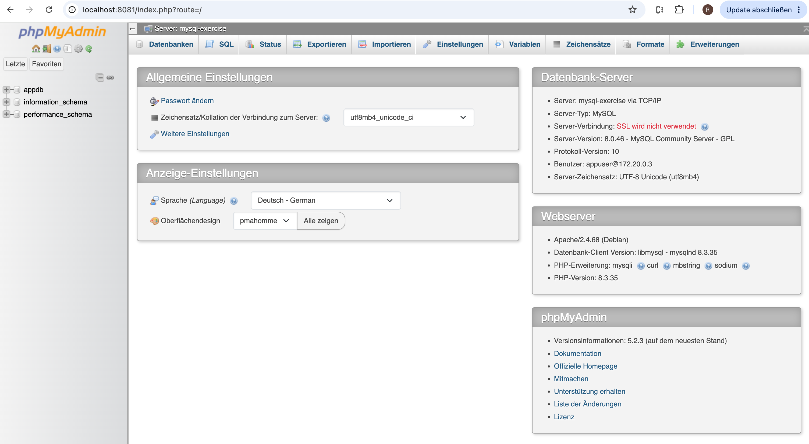
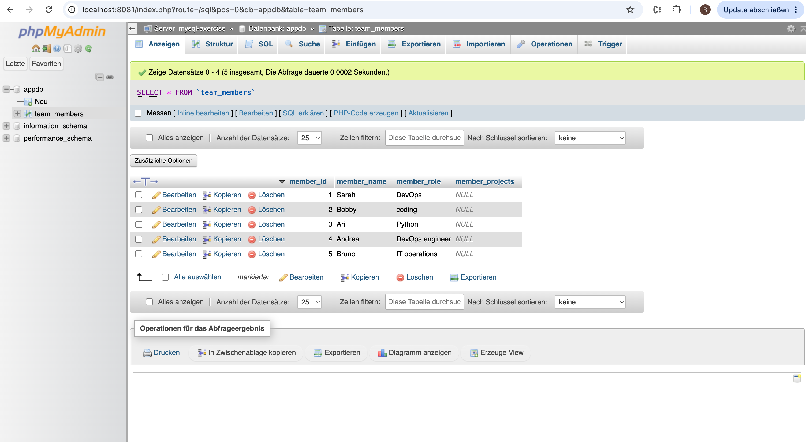
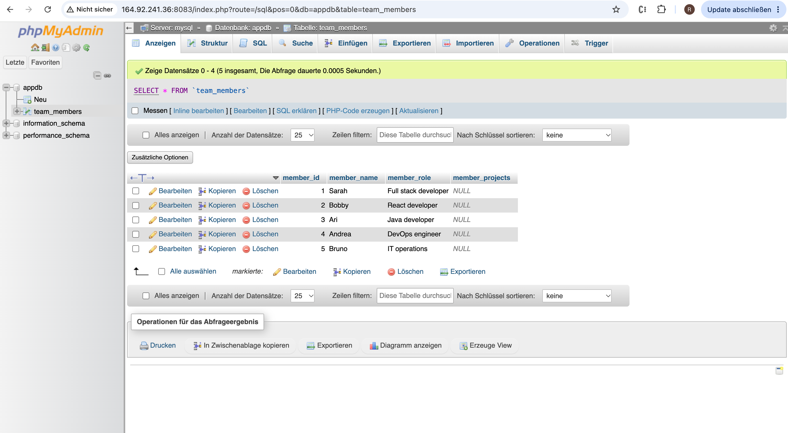
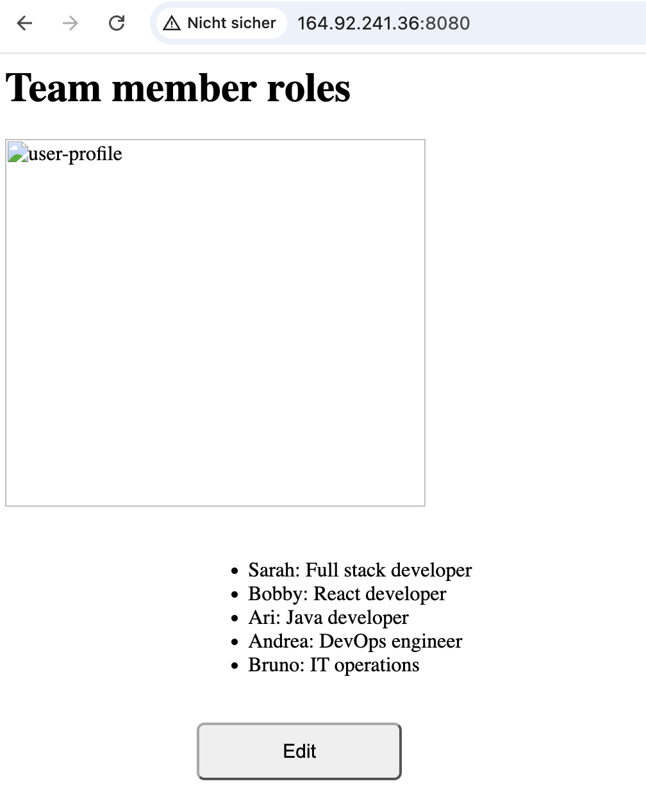
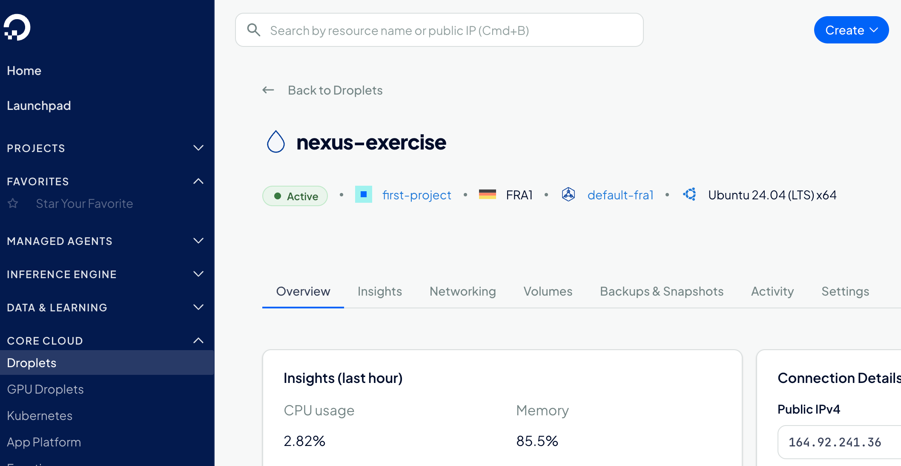

#### This project is for the Devops bootcamp exercise for 
#### "Containers - Docker" 

**MySQL-Container starten**
docker run --name mysql-exercise \
-e MYSQL_ROOT_PASSWORD=xxxxx \
-e MYSQL_DATABASE=xxxx \
-e MYSQL_USER=appuser \
-e MYSQL_PASSWORD=xxxx \
-p 3306:3306 \
-d mysql:8.0

**Export all needed environment variables for your application for connecting with the database**
export DB_USER=xxxx
export DB_PWD=xxxx
export DB_SERVER=xxxx
export DB_NAME=xxxx

**Build a jar file and start the application**
gradle build
java -jar build/libs/docker-exercises-project-1.0-SNAPSHOT.jar

## **EXERCISE 2: Start Mysql GUI container**

### **Start phpmyadmin container using the official image.**

_create network called mysql-network:_ docker network create mysql-network

_connect mysql-exercise to network:_ docker network connect mysql-network mysql-exercise
_starte the container phpmyadmin:_
docker run --name phpmyadmin \
--network mysql-network \
-e PMA_HOST=mysql-exercise \
-p 8081:80 \
-d phpmyadmin:latest

## **EXERCISE 3: Use docker-compose for Mysql and Phpmyadmin**

Create a docker-compose file with both containers --> yaml-file
stop and remove old Container
docker stop mysql-exercise
docker stop phpmyadmin

docker rm mysql-exercise
docker rm phpmyadmin
Test that everything works again: docker compose up -d

## **EXERCISE 4: Dockerize your Java Application**

Now you are done with testing the application locally with Mysql database and want to deploy it on the server to make it accessible for others in the team, so they can edit information.

And since your DB and DB UI are running as docker containers, 
you want to make your app also run as a docker container. 
So you can all start them using 1 docker-compose file on the server. So you do the following:

Create a Dockerfile for your java application... after dockerfile is created:
build the application: gradle build
build the docker image: docker build -t docker-exercises-app .

check the name of the application network: docker network ls --> docker-exercises_default

run the docker image of the application in the container:
docker run --name java-app \
--network docker-exercises_default \
-e DB_USER=appuser \
-e DB_PWD=apppassword \
-e DB_SERVER=mysql \
-e DB_NAME=appdb \
-p 8080:8080 \
docker-exercises-app

## **EXERCISE 5: Build and push Java Application Docker Image**

Now for you to be able to run your java app as a docker image on a remote server, it must be first hosted on a docker repository, so you can fetch it from there on the server. Therefore, you have to do the following:

**Create a docker hosted repository on Nexus**
1. create droplet on digital ocean
2. connect with the droplet and update apt: ssh root@2##.7#.3.2## and apt update
3. install docker: snap install docker
4. download nexus image and run it: docker pull sonatype/nexus3
5. create volume: docker volume create nexus-data
6. start container:
   docker run -d \
   --name nexus \
   -p 8081:8081 \
   -p 8082:8082 \
   -v nexus-data:/nexus-data \
   sonatype/nexus3
7. on the droplet find the password: docker exec nexus cat /nexus-data/admin.password
8. enter admin and password : under setting create new repository.
9. we need to do HTTP-Registry: in docker desktop
"insecure-registries": [
    "1##.9#.2##.##:8083",
    "1##.9#.2##.##:8082"
    ]
or by nano /var/snap/docker/3613/config/daemon.json add 
    snap restart docker
10. we have to tell docker where to push the image:
    docker tag java-app:1.0 1##.9#.2##.##:8082/java-app:1.0
Build the image locally and push to this repository
11. gradle build
12. docker build -t java-app:1.0 .
11. push: docker push 1##.9#.2##.##:8082/java-app:1.0

## **EXERCISE 6: Add application to docker-compose**

on local computer
gradle build
docker build --platform linux/amd64 -t java-app:1.0 .
docker tag java-app:1.0 164.92.241.36:8082/java-app:1.0
docker push 1##.9#.2##.##:8082/java-app:1.0
on digital ocean:
nano /var/snap/docker/3613/config/daemon.json
snap restart docker
docker pull 1##.9#.2##.##:8082/java-app:1.0
docker compose down
docker compose up -d
docker compose ps

